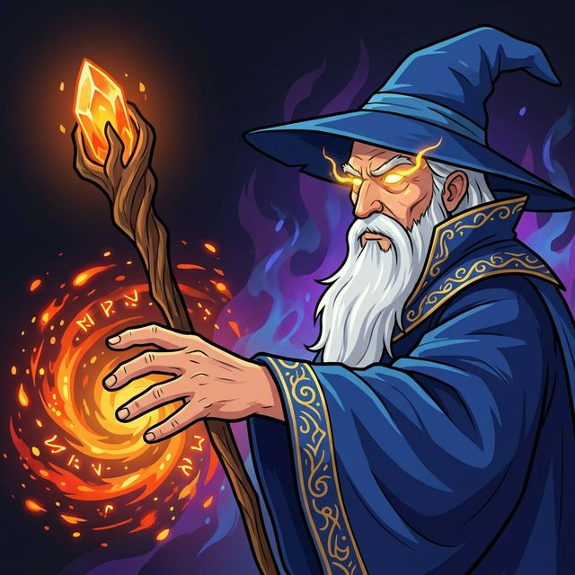

# Wizard vs Ogres: Ultimate Edition

Un juego de plataformas/roguelite trepidante y lleno de acción donde juegas como un poderoso Mago defendiendo los reinos místicos contra hordas interminables de Ogros, Trolls y Goblins.

## 🎮 Características del Juego

-   **Combate Dinámico**: Usa tu vara mágica para disparar bolas de fuego y diezmar a los enemigos.
-   **Hechizos Épicos**: Desbloquea habilidades devastadoras como:
    -   ⚡ **Rayo en Cadena**: Electrocuta a múltiples enemigos a la vez.
    -   🌪️ **Tornado**: Empuja a los enemigos con vientos poderosos.
    -   🐉 **Invocación de Dragón**: ¡Llama a un dragón para limpiar la pantalla!
-   **Progresión Roguelite**:
    -   Recoge **Monedas** de los enemigos derrotados.
    -   Visita la **Tienda** entre oleadas para comprar mejoras permanentes y nuevos hechizos.
    -   Elige entre **Cartas** aleatorias después de cada oleada para mejorar tus estadísticas (Salud, Velocidad, Daño, Multidisparo).
-   **Hermosos Biomas**: Viaja a través del Bosque Encantado, los Páramos Helados y los Infiernos Volcánicos.
-   **Enemigos Desafiantes**: Enfréntate a Goblins, Ogros masivos y Trolls regeneradores.

## 🕹️ Controles

| Acción | Tecla |
| :--- | :--- |
| **Mover** | `A` / `D` o `Flechas` |
| **Saltar** | `Espacio` / `W` / `Flecha Arriba` |
| **Disparar** | `Espacio` o `Clic Izquierdo Ratón` |
| **Tienda** | `S` (En Menú) |
| **Tornado** | `T` (Desbloqueable) |
| **Dragón** | `R` (Desbloqueable) |
| **Pausa/Menú** | `ESC` |

## 🚀 Cómo Jugar (¡Sin Instalación!)

El ejecutable del juego se encuentra dentro de la carpeta **`dist`**. **¡Haz clic en la imagen de arriba para descargarlo automáticamente!**

Si prefieres hacerlo manualmente:
1.  Ve a la carpeta **`dist`** en la lista de archivos de arriba.
2.  Haz clic en **`WizardVsOgres.exe`**.
3.  Haz clic en el botón **Download** (Descargar).
4.  ¡Haz doble clic en el archivo descargado para jugar!

---

### 💻 Para Desarrolladores (Código Fuente)

Si quieres modificar el código:
1.  Clonar repo: `git clone https://github.com/jordi1203/wizard-vs-ogres.git`
2.  Instalar Python y Dependencias: `pip install pygame`
3.  Ejecutar: `python main.py`

## 🛠️ Desarrollo

Construido con **Python** y **Pygame**.
-   `main.py`: El corazón del motor del juego.
-   `src/config.py`: Balance del juego y configuraciones.
-   `src/assets.py`: Dibujo procedural y efectos visuales.
-   `src/entities.py`: Lógica del Jugador y Enemigos.

---

*¡Creado para la experiencia de hechicería definitiva!* 🧙‍♂️✨
